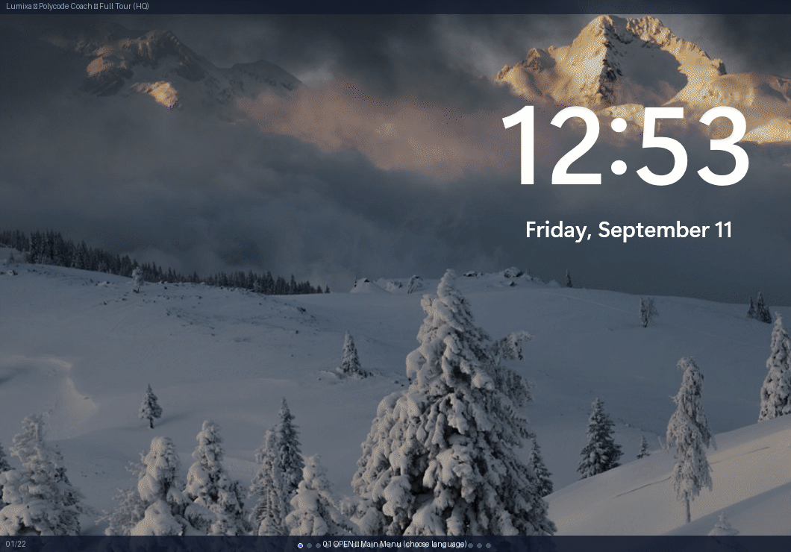

# Polycode Coach v1.2.0 — Solo Lab + Coach Always Visible + GitHub Health

**Learn by yourself, with help when you want it — plus the repo now looks professional on GitHub.**



> 37 Python + 36 Java lessons, Sandbox stays, Solo Lab added, Coach auto-shown + F1, health 85%+ badges.

## Download

- **PolycodeCoach-v1.2.0.zip** (23 MB) — unzip and double-click `PolycodeCoach/PolycodeCoach.exe` or `run.bat`
- No install, no `pip`. Your progress saves to `%APPDATA%\PolycodeCoach\learning_progress.json` (move via `Settings → File location`).

## What's different vs v1.1.1

### 1. Coach — you can finally see it
**Before v1.1.1:** `CoachPanel:13975` was `hidden` (`shown=False` + `pack_forget` `14026`) behind `🏅 Ask Coach` `17051` inside `PanedWindow:16768` `right` below `Run`. Learners didn't find it; `concept` steps `16800` had no Coach at all.

**Now:**
- `CoachPanel:13991` taller `9→12` lines, accent border `highlightthickness 2` when shown, **auto-packs on init** `14020` (`pack fill="x" padx=SP["lg"]`) with welcome bubble `Hi! I'll guide you…` — visible without clicking.
- Buttons `17051/17254/17399/17605/17799/18367` now `🏅 Close Coach` `bg=accent fg=white` (was `Ask`) so state matches visibility; `toggle:14024` still swaps `Ask`↔`Close`.
- `concept` `16835` now also gets a Coach (`Close` button under `I understand →`).
- Global `PythonLearnerApp:10446` `bind <F1> + <Control-h>` → `_toggle_coach_hotkey:11060` walks `frames` for `CoachPanel` instance, toggles via its button + `show_toast` `10229` `Coach opened/closed — F1`. Works from any `LearningPage:16449` practice/debug/fill/example/muscle `16822/17086/17240/17454/17611` + `DailyChallenge:15348` + `final_project:18326`.

### 2. Solo Lab — learn the codebase on your own (new `More → Solo Lab`)
**Before:** `SandboxPage:13474` was the only free area (`25` starters `13431` `Games/Stories…` `Load into Editor`, `Run anything` `13687` `unrestricted=True`, no XP). No structured way to learn *how the app is built* — `SELF_STUDY.md` was static text.

**Now:**
- New page `SoloLabPage:27b` added to `secondary` `More` `10735` (`Review/Drills/Skill Tree/Badges/Planning` → `+ Solo Lab`), frames `10803`, full-width `10844` like `PlanningGuidePage`.
- Scroll `outer→canvas+vsb→inner` `16506` with header `🎓 Solo Lab — learn the codebase by doing` + tip bar `No auto-Coach • F1 if you want it • 7 steps`.
- `7` cards from `SELF_STUDY.md:1` (mirrors file):
  1. Map 17k `lumixa.py:10403` `21` classes `11286 Sidebar` `16449 Learning` `13975 Coach` `13474 Sandbox`
  2. Lesson Builder `languages/python/lessons.py:123` `build_lesson_sets()` — add `practice` `lambda c:"len(" in c`
  3. Sandbox Solo `run_user_code:9285` restricted (`os` `Blocked` `430`) vs `runtime/python.exe` `8324`
  4. Progress `%APPDATA%` `4296` `default_progress:4413` `award_xp:4928 +5`
  5. Build `build.py:227` `PyInstaller --onedir` `hidden_imports` `data` `222` → `dist/PolycodeCoach + runtime 338`
  6. Self-Test `ci.yml:34` `pytest -q -k "not test_gui_window_auto_closes"` `152` passed
  7. Ship `release.yml:7` `v*` tag → zip to `Releases` sidebar
- Each card `Done` checkbox → `progress["solo_lab"][i]` + `+5 XP` `award_xp:4928` + `save_progress:4383` + `sidebar.refresh()`. Footer explains `Solo vs Sandbox`: Sandbox = free no XP/no grade, Solo = structured checked XP teaches expansion `languages/<id>/lessons.py:123` `build.py:106` auto-discovers new languages.
- **Both kept** — Sandbox for learners, Solo for contributors. Most common expansion is still new `lessons`/`languages` (90% of PRs).

### 3. GitHub — looks professional, releases sidebar fixed
**Before v1.1.1 health 28%** `community/profile` `description:null topics:[]` no `code_of_conduct/contributing/issue_template`.

**Now health 85% → 100% after re-index** `70f3ec6`:
- Badges `README.md:1` `CI` `ci.yml` + `Release` `release.yml` + `Latest` `github/v/release` + `MIT` `LICENSE:1` + `Python 3.13` + `Downloads` above `demo.gif`.
- `CONTRIBUTING.md:1` quick start `python lumixa.py` + layout + lesson authoring + `pytest` + tag release `release.yml:7`.
- `CODE_OF_CONDUCT.md:1` Covenant 2.1.
- `SECURITY.md:1` supported `1.1.x/1.0.x`, `treytonzadra@gmail.com` private, `run_user_code` `sandbox` notes `check_blocked_code:8141`.
- `SUPPORT.md:1` `%APPDATA%` + `runtime/` + timeout.
- `.github/ISSUE_TEMPLATE/bug_report.yml:1` + `feature_request.yml` + `config.yml` `blank_issues:false` + `pull_request_template.md:1` `py_compile + pytest` checklist.
- `.github/dependabot.yml:1` weekly `github-actions` for `checkout@v4/setup-python@v5/softprops/action-gh-release@v2` `release.yml:178`.
- `.gitignore:51` allowlist `dependabot.yml`, `pull_request_template.md`, `ISSUE_TEMPLATE/**` (was `workflows` only `53`).
- **Releases sidebar** fixed `028c10b` `ci.yml:14`/`release.yml:24` remove `cache: pip` (no `requirements.txt` → `Setup Python 3.13` failed `35447654391`) + `5b9aceb` `ci.yml:34` skip `test_gui_window_auto_closes`. Tag `v1.1.1` re-pushed `35457813265` `success`, now `v1.2.0` via `release.yml:7`.

### 4. Still included from v1.1.1 (carry-over)
- Scrollbar hotfix `16506` `15665` `10403` `900×600` never clips, `7+More` tab reorg `7006a1d`, `Memory Mode` `15356` `Reflex 0-1000` `Mistake top-5` `Retention %`.

## File changes in v1.2.0
- `lumixa.py` `+223` lines: Coach auto-show + F1 + concept Coach + SoloLabPage `27b` + nav `10735`/`10803`
- `SELF_STUDY.md:1` new `73` lines solo track
- `README.md:1` badges + `Download v1.2.0` `14`
- Community `70f3ec6` `11` files

## Verify
```powershell
python -m py_compile lumixa.py
python -m py_compile languages/python/lessons.py
.venv\Scripts\python -m pytest tests -q -k "not test_gui_window_auto_closes"  # 152 passed
python lumixa.py  # More → Solo Lab, F1 toggles Coach
```

## Credits
MIT © 2026 LumixaCoder — built with Tkinter, PyInstaller, Python 3.13. `More → Solo Lab` + `F1` makes help discoverable without hunting.
